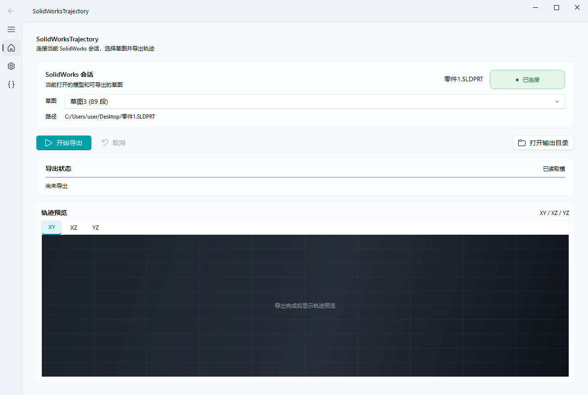
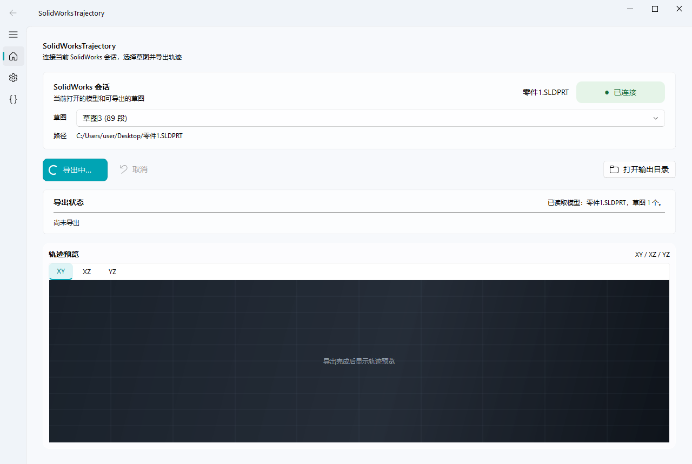

# SolidWorks 草图轨迹导出器


SolidWorksTrajectory 是一个 Windows 下的 SolidWorks 草图轨迹导出工具。它通过
SolidWorks COM 会话读取当前打开的模型和指定草图，将草图中的曲线采样后导出为
CSV，并提供 Fluent 风格图形界面用于选择草图、设置参数、查看进度和预览轨迹。

## GUI 预览

主界面包含 SolidWorks 会话状态、草图选择、导出控制、进度信息和 XY / XZ / YZ
轨迹预览。



导出或读取 SolidWorks 会话时，按钮会在文字左侧显示白色加载动画。



## 主要功能

- 连接当前运行中的 SolidWorks 会话。
- 显示当前模型及可用草图。
- 将选定草图导出为 CSV。
- 支持采样步长、曲面偏置、输出文件名和覆盖策略配置。
- 显示阶段进度、警告和错误信息。
- 提供 XY、XZ、YZ 三个方向的轨迹预览。
- 提供实时命令行信息页，便于诊断连接和导出问题。
- 保留兼容命令行入口，便于脚本调用。

## 运行环境

- Windows。
- 已安装并完成 COM 注册的 SolidWorks。
- Python 3.11 或更高版本，开发环境当前使用 Python 3.14。
- PySide6 和 PySide6-Fluent-Widgets。

目标计算机如果只运行 Release 中的打包程序，不需要安装 Python，但仍需要安装
SolidWorks，并且 SolidWorks COM 接口必须可用。

## 本地开发

在仓库根目录创建虚拟环境并安装依赖：

```powershell
py -m venv .venv
& .\.venv\Scripts\python.exe -m pip install -r .\trajectory_export_app\requirements.txt
```

启动 Fluent 图形界面：

```powershell
& .\.venv\Scripts\python.exe .\launch_gui_fluent.py
```

运行核心测试：

```powershell
& .\.venv\Scripts\python.exe -m unittest discover -s .\trajectory_export_app\tests -v
```

兼容命令行入口：

```powershell
& .\.venv\Scripts\python.exe .\export_solidworks_trajectory.py --help
```

## 构建 EXE

Fluent GUI 的单文件构建：

```powershell
& .\build_trajectory_gui_fluent_onefile.ps1
```

输出文件为：

```text
dist-fluent-onefile\SolidWorksTrajectory.exe
```

正式发布的 EXE 放在 GitHub Release 附件中，不提交到源码仓库。PyInstaller 构建
脚本会收集 QFluentWidgets 资源，并尝试把 Qt 依赖的 Windows ICU DLL 一起打包。

仓库中的 `build_trajectory_gui.ps1`、`build_trajectory_gui_onefile.ps1` 和
`build_trajectory_gui_nuitka.ps1` 保留为兼容或实验性部署路线。

## 项目结构

```text
launch_gui_fluent.py                 Fluent GUI 入口
launch_gui.py                        兼容 GUI 入口
export_solidworks_trajectory.py      命令行入口
build_trajectory_gui_fluent_onefile.ps1
                                    Fluent GUI 单文件构建脚本
trajectory_export_app/
  gui_fluent_workspace.py            Fluent 工作区界面
  gui.py                             兼容 PySide6 界面
  worker.py                          独立导出进程
  core.py                            导出核心逻辑
  config.py                          导出参数
  events.py                          进度事件与取消令牌
  solidworks_adapter.py              SolidWorks 适配层
  vendor/                            COM 连接和预检辅助模块
  tests/                             核心逻辑测试
docs/images/                         GUI 预览图
```

GUI 不直接持有 SolidWorks COM 对象。导出和会话访问由 Worker 进程负责，进度通过
JSON Lines 事件传回 GUI，以降低 COM 阻塞对界面的影响。

## 使用注意

- 导出前请确认选中了真正包含目标曲线的草图，而不是模型包围盒或其他辅助对象。
- SolidWorks 必须处于运行状态，并且当前文档已经打开。
- 单文件 EXE 更适合作为 GitHub Release 附件，而不是提交到源码仓库。

## 许可证

本项目采用 [GNU General Public License v3.0](LICENSE) 发布。

## 致谢

本项目的 Fluent 风格 GUI 使用 `PySide6-Fluent-Widgets`，设计和控件生态参考了
[PyQt-Fluent-Widgets](https://github.com/zhiyiYo/PyQt-Fluent-Widgets)。感谢该项目
作者及所有贡献者提供的开源工作。
